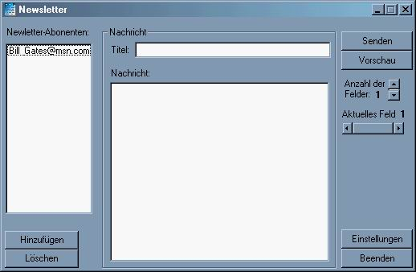



## Newsletter Creator

### Description

This Program generates a Newsletter in HTML format and sends it over E-Mail to all E-Mails which are listet in the textfile. This program is only German but it's easy to understand. You must have the "vbSendMail.dll" get it here: http://www.freevbcode.com/code/vbSendMail.zip
 
### More Info
 

             |
---                |---
**Submitted On**   |2002-05-29 19:09:32
**By**             |[MasterFX](https://github.com/Planet-Source-Code/PSCIndex/blob/master/ByAuthor/masterfx.md)
**Level**          |Intermediate
**User Rating**    |5.0 (10 globes from 2 users)
**Compatibility**  |VB 6\.0
**Category**       |[Internet/ HTML](https://github.com/Planet-Source-Code/PSCIndex/blob/master/ByCategory/internet-html__1-34.md)
**World**          |[Visual Basic](https://github.com/Planet-Source-Code/PSCIndex/blob/master/ByWorld/visual-basic.md)
**Archive File**   |[Newsletter881235292002\.zip](https://github.com/Planet-Source-Code/masterfx-newsletter-creator__1-35242/archive/master.zip)

